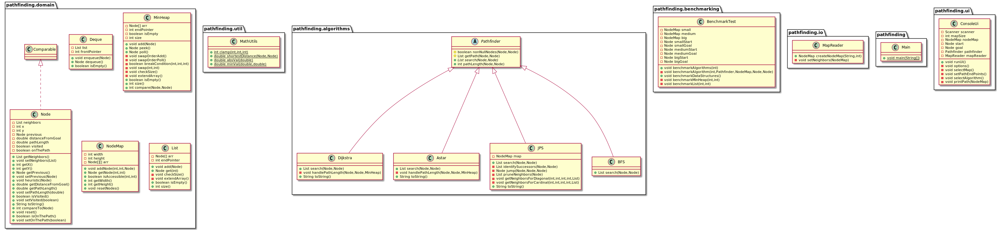

# Implementation

## Project Structure



The project has changed from the initial specification; the most notable change is the inclusion of the Jump Point Search algorithm. Because of its inclusion, the breadth-first search algorithm is not actually a part of the project proper, although it is present in the code. As a word of warning, this project uses the coordinate points backwards (y, x) instead of the typical (x, y). This is because I've found it a helpful way to think about coordinates in programming.


## `pathfinding.algorithms`
The pathfinding algorithms are extentions of the abstract _Pathfinder_-class, which takes care of counting the nodes on the path, mainly useful in testing. The algorithms are based on a generic search alogirthm template, in pseudocode below.

```
search(start_node):
    node_list = list()                # empty list (queue/stack/...)
    visited = set()                   # empty set
    add start_node to node_list
    while list is not empty:
        node = node_list.first()       # pick the next node to visit
        remove node from node_list        if node not in visited:
        visited.add(node) 
            if goal_node(node):
                return node              # goal found
            add node.neighbors() to node_list
        end if
    end while
    return None                       # no goal found
``` 
For Dijkstra's algorithm, A*, and Jump Point Search the `node_list` is a priority queue, implemented in this project as a binary minimum heap. The program also uses an adjacency list for `node.neighbors()`. We can see that the time and space complexities for the pathfinding algorithms are as follows:

 | Algorithm | Time | Space |
 |:----------|:-----:|:-----:|
 | Dijkstra's algorithm | *O(V + E log V)* | *O(V)* |
 | A* | *O(E)* | *O(V)* |
 | Jump point search | *O(E)* | *O(V)* |

 Where E = number of edges, V = number of vertices.

 ### Jump Point Search
 While Dijkstra's algorithm and A* both were familiar before this project, Jump Point Search was a completely new algorithm. It does still follow the pseudocode above where applicable, since it is based on A*. This projects version is based on examples found in the original paper describing the algorithm, as well as other examples found online (for example). The path given by the program consists of the jump points only.   

 ## `pathfinding.domain`
 The implemented data structures `MinHeap`, `List`, and `Deque` don't offer the full functionality of their Java counterparts. Only the functions required by the search algorithms are implemented.

 ### `MinHeap`
 The `MinHeap` replaces the `java.util.PriorityQueue`. As its name implies, it is an implementation of a minimum heap. Because it is a balanced binary tree, its height is _O(log N)_, where _N_ is the number of vertices, or `Nodes`, in the tree. As such, the operations `add(Node)` and `poll()` take at most _O(log N)_ to reorder the tree. The `peek()` returns the minimum `Node` in the heap, found always at index 1, thus taking constant time _O(1)_. All this is true if it is implemented correctly, but since the `MinHeap` is a massive bottleneck, there are some problems with this implementation.

 ### `List`
 The array based `List` implementation offers only two functions, `add(Node)` and `get(int)`. Both work as expected, and in constant time _O(1)_.

 ### `Deque`
 Based on the above `List`, the `Deque` also offers only two functions, `enqueue(Node)` and `dequeue()`. The `dequeue()` function doesn't actually remove or delete anything, it simply returns the `Node` at `list.get(frontPointer)` and increments `frontPointer`. The `enqueue(Node)`function works as one would expect. Both take constant time _O(1)_.

### `Node` and `NodeMap`
`Node` is a representation of a point in the map. Blocks, or null points, do not get made into `Nodes`.

`NodeMap` is an abstraction of the map, based on a two-dimensional array consisting of `Nodes`. It offers some utility functions especially useful in Jump Point Search.

## `pathfinding.io`

### `MapReader`
`MapReader` reads in a map file and turns it into a `NodeMap` with `createNodeMap(filename, mapSize)`.

## `pathfinding.ui`

### `ConsoleUi`
The program has a very basic text UI, through which one can try finding shortest paths on a map with their chosen algorithm, or run the benchmarking tests.

## `pathfinding.benchmarking`

### `BenchmarkTest`
All benchmarking tests can be found in this class. The tests cover both the algorithms and the data structures. More on this topic [here](Testing.md).

## Possible improvements
- Better benchmarking: both how it's done and what is tested. The benchmarking tests invlove some stupid hard coding. The tests could also propably be extended.
- The program could be expanded to make better use of the pathfinding. Now it only enables pathfinding on five different 256x256 maps.
- Better UI and UX.
- Better unit testing.
- A good implementation of `MinHeap`.

## Sources
- 
- 
- 
- 
- 
