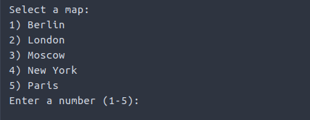

# User guide

## Running the program

 ### The jar:
The `malpel-pathfinding.jar` file can be downloaded [here](https://github.com/Malpel/malpel-pathfinding/releases/tag/v1.0-final). To run the program successfully the file has to be in the same folder as the folder `maps`, which comes with the source code and can be found directly in the project root. Once the jar is in place, double click the file, or launch the program through the command line with `java -jar malpel-pathfinding.jar`.

## UI

The program has a simple text ui. The options will be printed on the screen.

Entering 1 will let you find shortest paths on different maps.

After selecting the map, enter coordinates for start and goal for the map.

Next, choose an algorithm.

The program will now find the shortest path between the given points and print it on the screen with the length of the path. Afterwards, the options presented in the beginning will be shown again.

Entering 2 will run the benchmarking tests and print their results on the screen. Tests for both algorithms and data structures will be run. These take some time (around 10 minutes).

Entering 3 will simply shut down the program.
